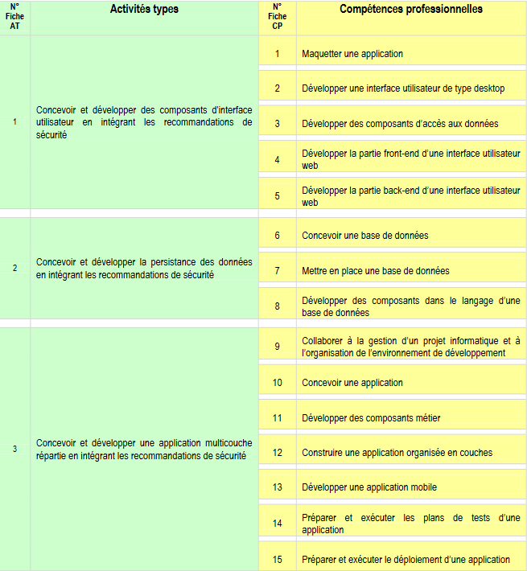

<h1 align="center">Dossier Projet Concepteur Développeur d'Applications</h1>

### TABLE des matières
1. [Liste des compétences du référentiel couvert par le projet](./assets/skills_cda.png)
2. [Résumé du projet (en anglais)](#project_resume_eng)
3. [Cahier des charges/Expression des besoins du projet](#project_need)
4. [Gestion de projet](#project_management)
5. [Spécifications fonctionnelles du projet](#project_features_specs)
6. [Spécifications techniques du projet](#project_technical_specs)
7. [Réalisations du candidat par compétences](#realizations)
8. [Présentation du jeu d'essai](#test_data)
9. [Veille sur la sécurité](#security_check)
10. [Description d'une situation de travail ayant nécessité une recherche et effectuée par le candidat durant le projet](#research_during_project)

<h2>Liste des compétences du référentiel qui sont couvertes par le projet</h2>

